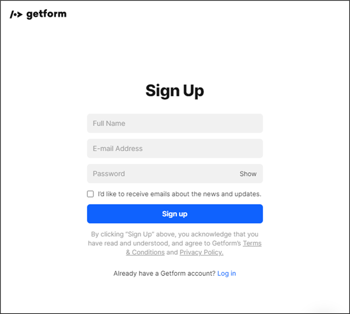
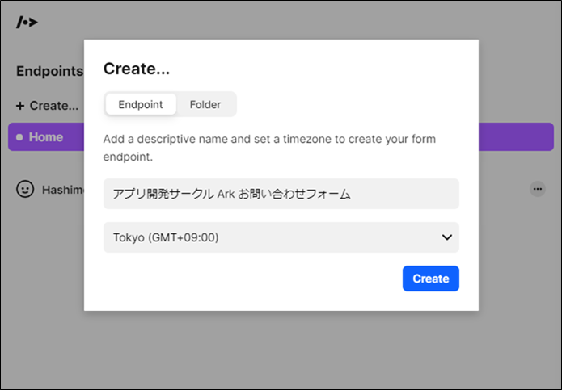
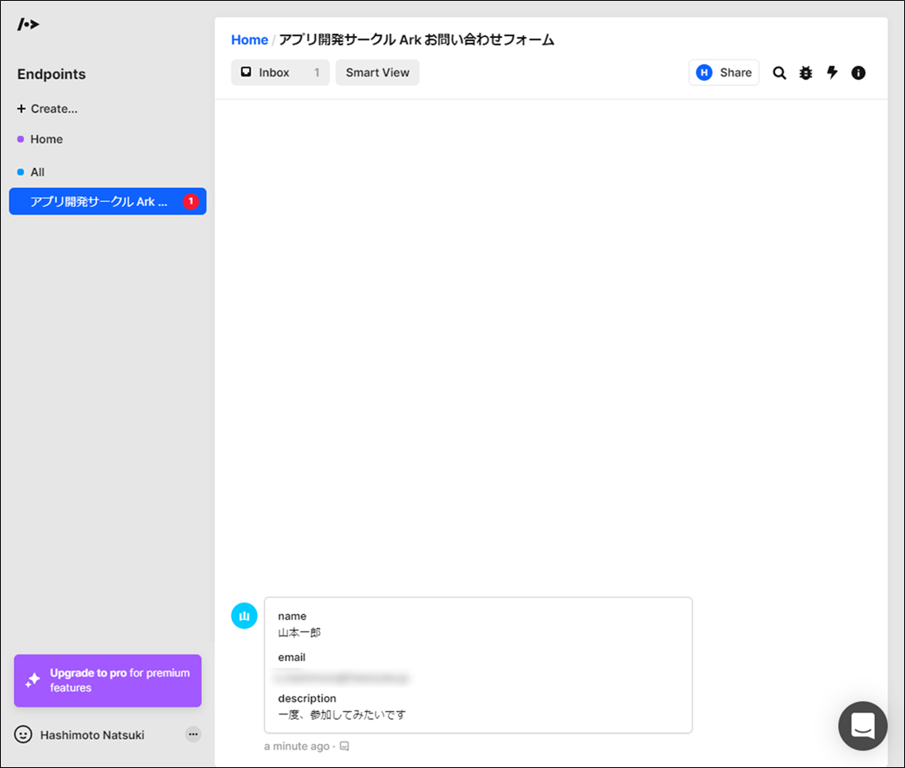

# Getform.io でお問い合わせの管理

Getform.io  
https://getform.io/

Getform.io はお問い合わせフォームのエンドポイントになって、
それを管理できるサービスです😌

フォームを作成するたびにエンドポイントを発行してくれます！

個人利用の無料プランでは下記が無料です😄

- 1フォーム
- 一ヶ月あたり100件のお問い合わせ
- 単一ファイルのアップロード
- 100MBのファイルストレージ
- デフォルトのThanksページ
- チームメンバーを1人招待する
- スパム保護
- Zapierとの統合
- Getform API

## フォームの使い方

### アカウントの作成

Getform.io のサイトトップページから「Generate endpoint for free」をクリック

アカウント登録を実施

登録したメールアドレスにメール認証のメッセージが届くので、「Verify email」をクリック

